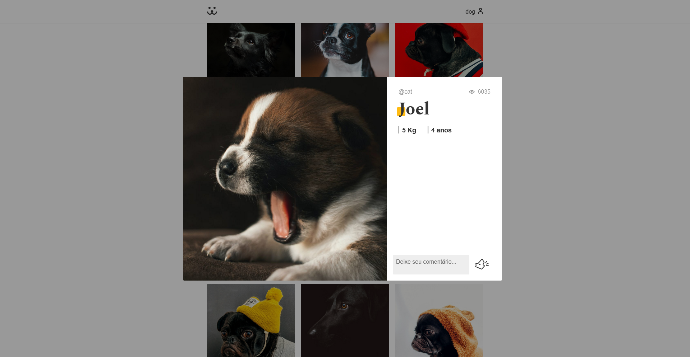

# Dogs 

> Rede social para pets criada com React

### Ajustes e melhorias

Projeto concluído!

- [x] Desenvolvimento de todo o projeto em SPA utilizando React 
- [x] Páginas responsivas
- [x] Consumo de REST API feita para o projeto

## 💻 Pré-requisitos

Antes de começar, verifique se você atendeu aos seguintes requisitos:

* Você instalou a versão mais recente de `Node.js`.

## 🚀 Instalando Dogs

Para instalar o Dogs, siga estas etapas:

* Clone esse repositório com `git clone https://github.com/gguilhermelopes/dogs`
* Entre na pasta com `cd dogs`
* Instale as dependências com `npm install`

## ☕ Usando Dogs

Para usar Dogs, siga estas etapas:

* Certifique-se de que todas as dependências foram instaladas e que esteja na pasta do projeto. Utilize `npm start`
